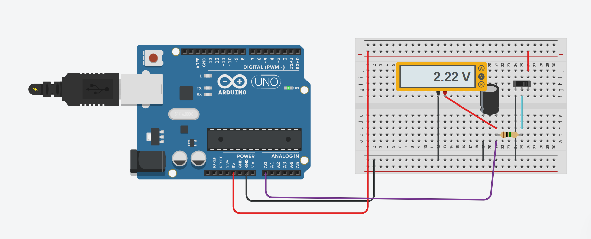
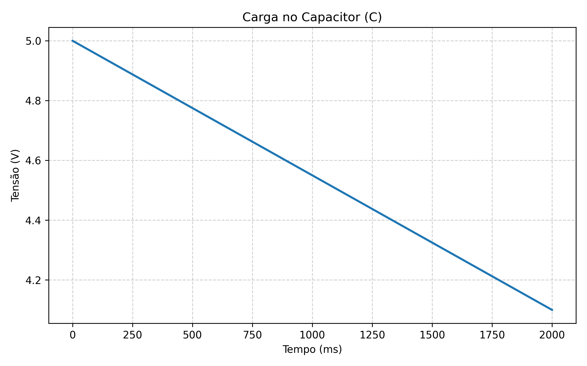
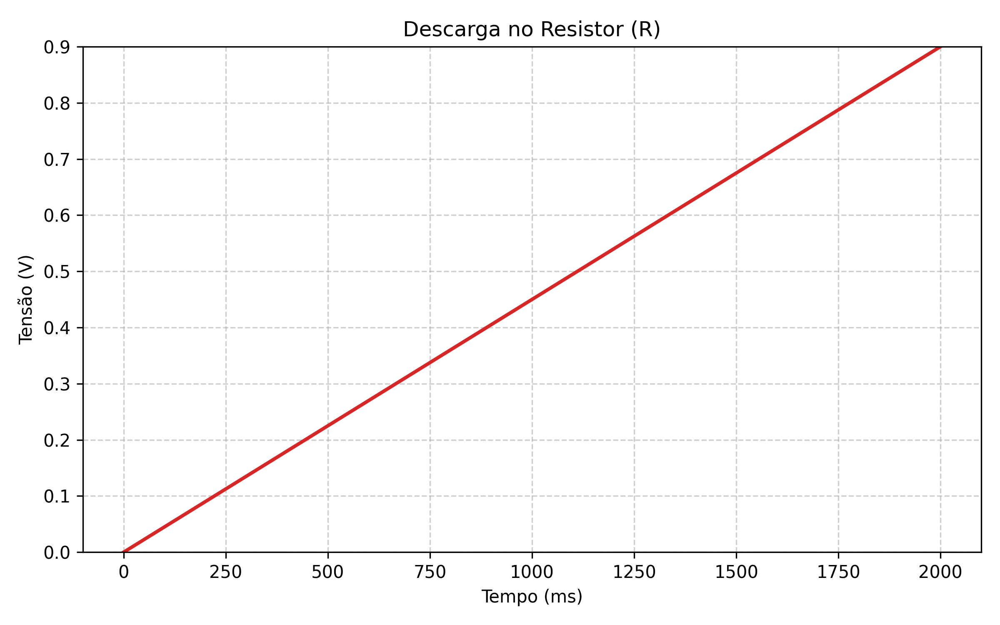
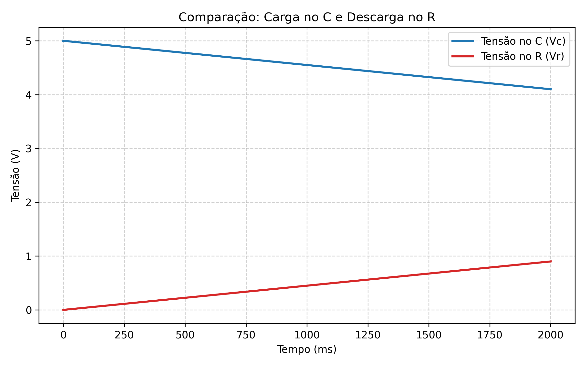

# Circuito RC - Carga e Descarga pelo Mesmo Resistor

Este projeto demonstra o comportamento de um **circuito RC** (resistor + capacitor) utilizando o **Arduino Uno** como monitor de tensão.  
O objetivo é observar, de forma prática, o processo de **carga e descarga do capacitor**, controlado por uma chave, e visualizar as curvas de tensão no tempo.


## Componentes Utilizados
- 1 × Arduino Uno  
- 1 × Capacitor eletrolítico de **10 µF / 25 V**  
- 1 × Resistor de **1 MΩ**  
- 1 × Chave SPDT (duas posições)  
- 1 × Protoboard  
- 1 × Voltímetro (ou multímetro digital)  
- Jumpers para conexão


##  Montagem do Circuito

A montagem foi realizada no **Tinkercad Circuits**.  
Você pode acessar o projeto clicando no link abaixo:

🔗 **[Abrir no Tinkercad](https://www.tinkercad.com/things/j1HtDpSlhaj-incredible-amur/editel?returnTo=https%3A%2F%2Fwww.tinkercad.com%2Fdashboard&sharecode=xGI6r0wqgyNQQ7jPccJGuc5tuV_SjpC2P7RI9jeuoWc)**

Imagem da simulação:



O circuito foi montado conforme o diagrama abaixo:

- **C1 (10 µF)**:  
  - Polo positivo conectado ao **nó de medição** (ponto central do circuito).  
  - Polo negativo conectado ao **GND** do Arduino.

- **R1 (1 MΩ)**:  
  - Um terminal conectado ao **nó de medição**.  
  - O outro terminal ligado ao **comum (C)** da **chave SPDT**.

- **Chave SPDT**:  
  - Um polo conectado ao **+5 V** do Arduino.  
  - O outro polo conectado ao **GND**.  
  - O pino comum (C) vai até o resistor de 1 MΩ.  
  Assim, a chave alterna o resistor entre 5 V e GND, permitindo **carga e descarga pelo mesmo resistor**.

- **A0 (Arduino)**:  
  - Conectado ao **nó de medição**, para leitura da tensão do capacitor.

- **Voltímetro**:  
  - Ligado em paralelo com o capacitor (mesmo ponto de medição do A0), para acompanhamento visual da tensão.


## Funcionamento

Quando a **chave está ligada ao VCC (+5 V)**:
- O capacitor **carrega** através do **resistor de 1 MΩ**, com corrente limitada pela resistência alta.  
- A carga é lenta, e a tensão no capacitor segue a curva exponencial:
  \[
  V_C(t) = V_{max}(1 - e^{-t/RC})
  \]

Quando a **chave é movida para o GND**:
- O capacitor **descarga** através do **mesmo resistor**, de forma igualmente lenta:
  \[
  V_C(t) = V_{max} e^{-t/RC}
  \]

Como \( R = 1\,MΩ \) e \( C = 10\,µF \), a constante de tempo é:
\[
\tau = R \times C = 10\,\text{segundos}
\]

Isso significa que:
- Após 10 segundos, o capacitor carrega aproximadamente **63% da tensão máxima (≈3,15 V)**.  
- O processo de **descarga** segue a mesma regra temporal, resultando em curvas simétricas.

---

## Código Arduino Utilizado

```cpp
int pinoNoRC = A0;
int valorLido = 0;
float tensaoCapacitor = 0, tensaoResistor;
unsigned long tempo;

void setup() {
  Serial.begin(9600);
}

void loop() {
  tempo = millis();
  valorLido = analogRead(pinoNoRC);
  tensaoResistor = (valorLido * 5.0 / 1023);
  tensaoCapacitor = abs(5.0 - tensaoResistor);

  Serial.print(tempo);
  Serial.print(" ");
  Serial.print(tensaoResistor, 2);
  Serial.print(" ");
  Serial.println(tensaoCapacitor, 2);

  delay(400);
}
```
Foram gerados três gráficos para análise:

- Carga no Capacitor (C)

- Descarga no Resistor (R)

- Comparação entre as duas curvas
  
## 📈 Resultados 

Os dados foram coletados via **Monitor Serial** e processados em Python.  
A seguir, são apresentados os gráficos gerados:

### 1️⃣ Carga no Capacitor (C)


### 2️⃣ Descarga no Resistor (R)


### 3️⃣ Comparação: Carga no C e Descarga no R

