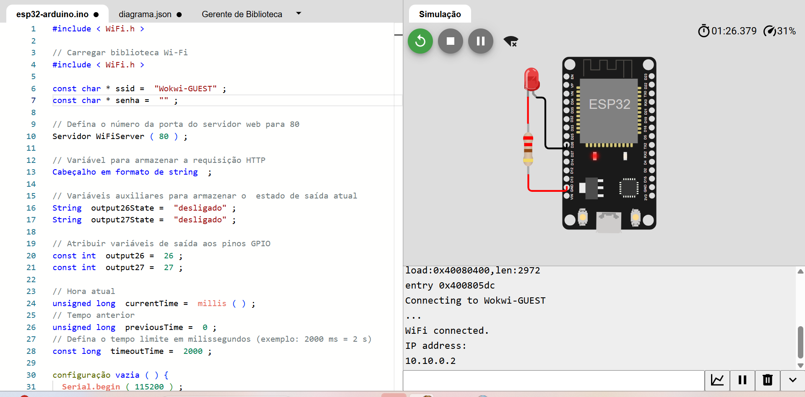

# Relatório Técnico – Análise de Segurança do Servidor Web ESP32

## 1. Introdução
Este relatório analisa a segurança do exemplo de servidor web local com ESP32, baseado no tutorial “ESP32 Web Server – Arduino IDE”.
O código cria uma página web simples para ligar e desligar saídas digitais do ESP32, mas apresenta alguns pontos fracos que podem ser explorados para ataques dentro da rede local ou, caso seja exposto, pela internet.

## 2. Pontos fracos do código (análise estática)
Principais vulnerabilidades observadas no código do servidor:

- Não há autenticação. O servidor não pede usuário ou senha; qualquer dispositivo na mesma rede que descubra o IP pode acessar a página e chamar diretamente os endereços /26/on, /26/off, /27/on e /27/off.

- Comunicação sem criptografia (HTTP simples). Toda a comunicação é em texto claro, o que permite que alguém na mesma rede capture o tráfego, veja os comandos enviados e até repita esses comandos depois.

- Tratamento de pedidos frágil. O código apenas procura trechos como "GET /26/on" dentro de uma string que acumula todo o cabeçalho, sem validar bem o formato da requisição nem impor um limite rígido de tamanho.

- Possível travamento por excesso de pedidos. O ESP32 atende um cliente por vez, em um trecho de código que pode ficar preso por até 2 segundos por conexão, sem controle de quantidade de acessos; vários pedidos ao mesmo tempo ou pedidos muito lentos podem travar o funcionamento normal.

## 3. Ataque 1 – Controle remoto sem autorização

### 3.1. Descrição e passo a passo
Cenário: o ESP32 está conectado ao roteador de casa ou do laboratório, com o código do tutorial rodando sem modificações.  
Um atacante na mesma rede pode seguir estes passos:

**Descobrir o IP do ESP32**  
Usar um aplicativo de varredura de rede (como Fing no celular ou nmap em um computador) para listar os dispositivos conectados e ver quais respondem na porta 80.

**Abrir a página do ESP32**  
Digitar o IP encontrado no navegador, por exemplo http://192.168.X.X.  
Se a página mostrar algo como “ESP32 Web Server” e botões para GPIO 26 e 27, o atacante confirma que aquele IP é do ESP32.

**Enviar comandos diretamente**  
Em vez de só usar os botões da página, o atacante pode chamar:
- http://<ip>/26/on para ligar a saída 26.
- http://<ip>/26/off para desligar a saída 26.
- http://<ip>/27/on e http://<ip>/27/off para a saída 27.

O servidor não verifica quem está mandando o comando, então qualquer pessoa com acesso à rede consegue controlar as saídas.

**Automatizar o abuso**  
Com um script simples, o atacante pode ligar e desligar as saídas rapidamente, em horários específicos ou em resposta a outros eventos.

### 3.2. Probabilidade, impacto e risco

**Probabilidade**  
Em redes com vários usuários (casa com visitas, coworking, laboratório, empresa), a chance é alta, pois ferramentas para escanear a rede são fáceis de usar.  
Se a porta for aberta para a internet via roteador (port forwarding), a probabilidade aumenta ainda mais, pois robôs automáticos varrem a internet atrás de portas abertas.

**Impacto**  
Se o ESP32 controlar apenas LEDs de teste, o impacto é baixo.  
Se estiver controlando relés ligados a equipamentos reais (bombas, portões, iluminação, etc.), o impacto pode ser alto: acionamento indevido de cargas, desgaste do equipamento, possíveis riscos de segurança física e interrupção de uso normal.

**Risco resultante**  
Com probabilidade alta e impacto potencial alto em aplicações reais, o risco desse ataque é classificado como alto.

---

## 4. Ataque 2 – Travar o ESP32 com muitos pedidos (DoS)

### 4.1. Descrição e passo a passo
Aqui a intenção é fazer o ESP32 parar de responder ou ficar reiniciando, impedindo o uso normal do sistema.  
Passos possíveis de um atacante na mesma rede:

**Abrir várias conexões lentas**  
O atacante abre várias conexões para o IP do ESP32 na porta 80 e começa a enviar o pedido HTTP muito devagar, permitindo que o código fique preso esperando completar a mensagem por até 2 segundos por conexão.

**Enviar mensagens muito grandes**  
O cabeçalho da requisição é guardado em uma única string na memória; enviando mensagens grandes, o atacante pode consumir bastante memória do ESP32, causando instabilidade ou travamentos.

**Enviar muitos pedidos seguidos**  
Usando ferramentas de teste de carga ou scripts, o atacante manda muitos pedidos em sequência, mais do que o ESP32 consegue processar.

**Resultado:**  
O ESP32 fica muito lento, deixa de responder ou entra em ciclos de reinicialização, interrompendo o controle das saídas.

### 4.2. Probabilidade, impacto e risco

**Probabilidade**  
Qualquer pessoa com conhecimentos básicos e acesso à rede consegue usar scripts ou programas prontos para gerar esse tipo de carga; a probabilidade é considerada média.

**Impacto**  
Em um protótipo de bancada, o impacto é baixo.  
Em uma aplicação prática, o travamento pode causar perda temporária de controle, falha de serviço e necessidade de intervenção manual.

**Risco resultante**  
Com probabilidade média e impacto de médio porte em aplicações reais, o risco geral desse ataque é considerado médio.

---

## 5. Tabela consolidada de ataques (ordenada por risco)

Tabela resumo dos ataques analisados, do maior para o menor risco:

| Título do ataque                                | Probabilidade | Impacto | Risco |
|--------------------------------------------------|--------------|---------|-------|
| Controle remoto sem autorização dos GPIOs        | Alta         | Alto    | Alto  |
| Travar o ESP32 com muitos pedidos (DoS)          | Média        | Médio   | Médio |
| Copiar e repetir comandos HTTP na rede (replay)  | Média        | Médio   | Médio |
| Descobrir tipo e características do dispositivo  | Alta         | Baixo   | Baixo |

---
## 6. Montagem conforme tutorial

Apesar das limitações da versão gratuita do Wokwi, que não permite o uso do IoT Gateway para envio de requisições HTTP externas, foi possível executar o código do ESP32, observar o funcionamento correto do servidor web e validar o acionamento das GPIOs durante a simulação.

A seguir, são apresentadas as evidências visuais da execução:

### 📸 6.1 Print da Simulação

### 🎥 6.2 Vídeo da Execução
[Vídeo da simulação no Wokwi](https://drive.google.com/file/d/14o-bxLYLpJKQ0lwi6Vzxh8Qb3DVPXAXD/view?usp=sharing)

Esses registros confirmam que o código foi executado corretamente no ambiente virtual, demonstrando o comportamento esperado do servidor web e das saídas digitais.

## Referências (ABNT)

RANDOM NERD TUTORIALS. ESP32 Web Server – Arduino IDE. [S.l.], 2019. Disponível em: https://randomnerdtutorials.com/esp32-web-server-arduino-ide/. Acesso em: 9 dez. 2025.

RUI SANTOS. WiFi_Web_Server_Outputs.ino (ESP32 Web Server – Outputs). GitHub: RuiSantosdotme/ESP32-Course. [S.l.], 2020. Disponível em: https://github.com/RuiSantosdotme/ESP32-Course/blob/master/code/WiFi_Web_Server_Outputs/WiFi_Web_Server_Outputs.ino. Acesso em: 9 dez. 2025.

ARDUINO FORUM. HTTP in local webserver: what are the risks? Arduino Forum. [S.l.], 26 dez. 2023. Disponível em: https://forum.arduino.cc/t/http-in-local-webserver-what-are-the-risks/1204158. Acesso em: 9 dez. 2025.

EEVBLOG. Running a web server on an embedded system – risky? EEVblog Forum. [S.l.], 14 nov. 2021. Disponível em: https://www.eevblog.com/forum/embedded-computing/running-a-web-server-on-an-embedded-system-risky/. Acesso em: 9 dez. 2025.

ESPRESSIF. SimpleWiFiServer.ino (ESP32 WiFi library example). GitHub: espressif/arduino-esp32. [S.l.], 2016. Disponível em: https://github.com/espressif/arduino-esp32/blob/master/libraries/WiFi/examples/SimpleWiFiServer/SimpleWiFiServer.ino. Acesso em: 9 dez. 2025.

CVEDETAILS. Espressif Arduino-esp32 security vulnerabilities, CVEs, versions and CVE reports. [S.l.], 2024. Disponível em: https://www.cvedetails.com/product/59120/Espressif-Arduino-esp32.html. Acesso em: 9 dez. 2025.

ABB. Missing Authentication Vulnerability and its Mitigations. [S.l.], 2021. Disponível em: https://search.abb.com/library/Download.aspx?DocumentID=4TZ00000006007&LanguageCode=en&DocumentPartId=PDF&Action=Launch. Acesso em: 9 dez. 2025.
